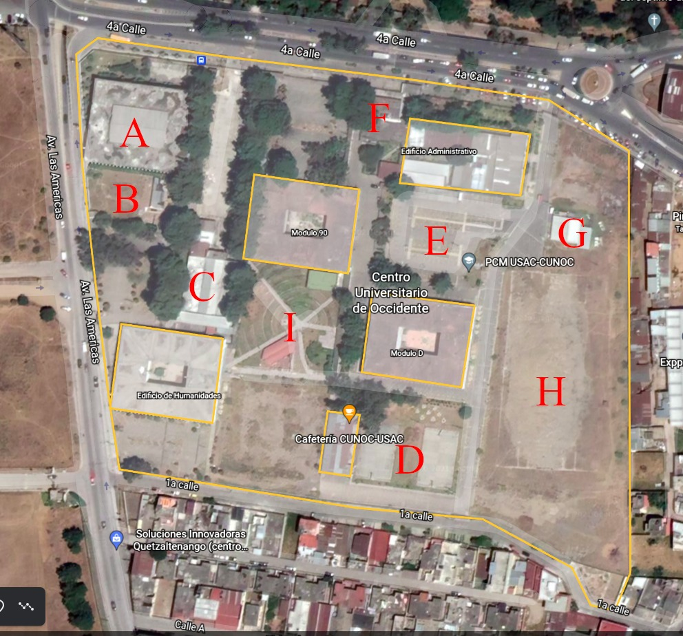
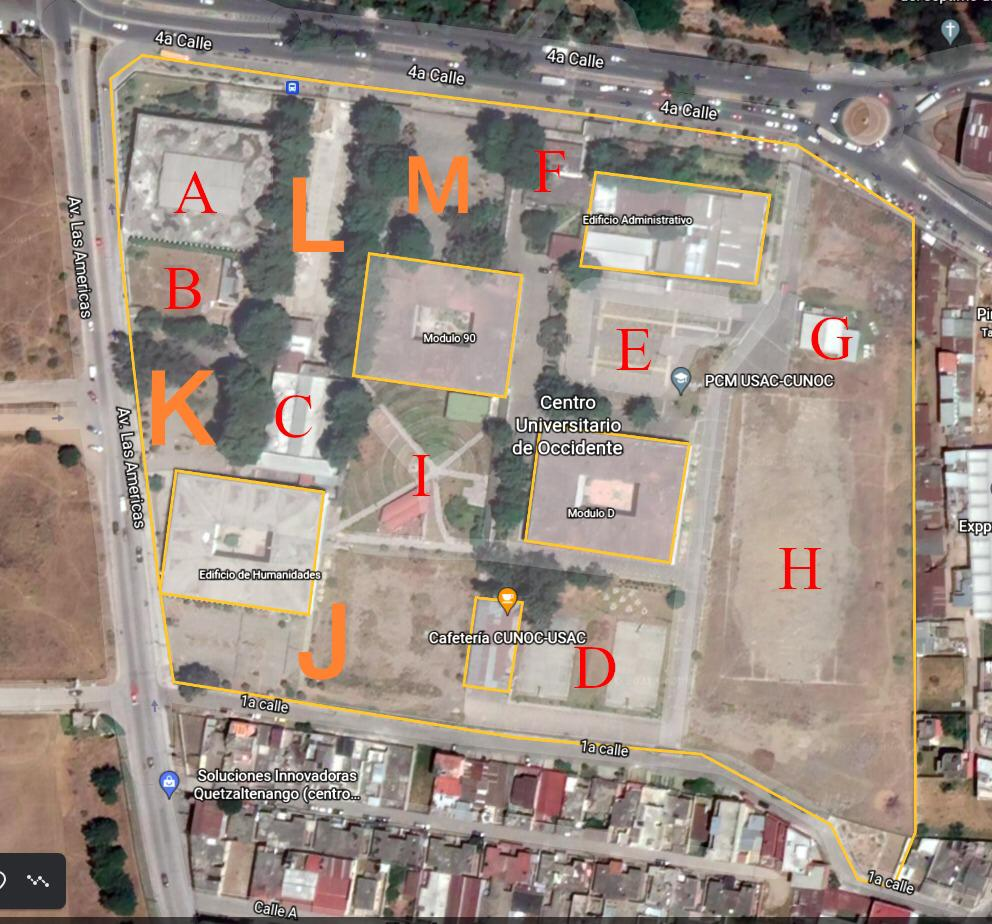

```{r setup, include=FALSE}
# load used packages
library(package = "tidyverse")

# plotting theme
theme_set(
  theme_bw() +
    theme(
      title = element_text(face = "bold"),
      plot.subtitle = element_text(face = "plain")
    )
)

# set up knitting
knitr::opts_chunk$set(echo = FALSE, message = FALSE, warning = FALSE)
```


```{r data, include=FALSE}
departments <- read_rds("data/departments.rds")

# all USAC centers
centers <- read_csv("data/centros_usac.csv") %>%
  sf::st_as_sf(
    crs = 4326,
    coords = c("long", "lat")
  ) %>%
  print()


# USAC main campus limits
# Read in raw shapes
buildings_usac <- sf::read_sf("data/usac.osm", layer = "multipolygons") %>%
  print()

# Define university limits
limits <- buildings_usac %>%
  filter(name == "Universidad de San Carlos de Guatemala") %>%
  print()


# Zonification by Ligia Ruiz
usac_zones <- sf::read_sf("data/usac/zonas/zonas_usac.shp") %>%
  sf::st_transform(crs = 4326) %>%
  transmute(
    id = 1:n(),
    zona = ZON %>% tolower()
  ) %>% 
  print()


# grouped buildings
buildings <- buildings_usac %>%
  filter(
    name != "Universidad de San Carlos de Guatemala",
    !grepl("Area agr|Villa Sol|Escuela De Aplicación", name)
  ) %>%
  sf::st_intersection(limits) %>%
  select(name) %>%
  sf::st_join(
    usac_zones %>%
      mutate(
        zona = factor(zona, levels = unique(zona))
      ),
    largest = TRUE
  ) %>%
  # add missing features
  bind_rows(
    # EFPEM
    matrix(
      c(
        -90.54715437758186, 14.588543773747414,
        -90.5454002129073, 14.588289391731363,
        -90.54561210742162, 14.586807221279653,
        -90.54702831377278, 14.586962966455081,
        -90.54699076285198, 14.58770535027224,
        -90.54728580584128, 14.587907818151093,
        -90.54715437758186, 14.588543773747414
      ),
      ncol = 2, byrow = TRUE
    ) %>%
      sf::st_multipoint() %>%
      sf::st_cast(to = "POLYGON") %>%
      sf::st_sfc(crs = 4326) %>%
      sf::st_sf() %>%
      mutate(name = "EFPEM", zona = "área deportiva"),
    
    # Escuela De Aplicación Dr. Carlos Martínez Durán
    matrix(
      c(
        -90.54710780044341, 14.586892642531861,
        -90.54565077344431, 14.58672675276754,
        -90.54580414470738, 14.585107138238305,
        -90.54732432457949, 14.585290491424512,
        -90.54710780044341, 14.586892642531861
      ),
      ncol = 2, byrow = TRUE
    ) %>%
      sf::st_multipoint() %>%
      sf::st_cast(to = "POLYGON") %>%
      sf::st_sfc(crs = 4326) %>%
      sf::st_sf() %>%
      mutate(name = "Escuela De Aplicación Dr. Carlos Martínez Durán", zona = "área deportiva"),
    .
    ) %>%
      arrange(zona) %>%
  mutate(
    n = 1:n(),
    name = name %>%
      sub("(aire libre)", "\\1 cerca de T11 y AEU", .)
  ) %>%
  print()

```


El nivel inicial debe ser el Centro Universitario, que nos permite colocar los casos en el mapa a nivel departamental.
Esto se refiere al centro universitario en donde ocurrió el acoso, que puede no ser el mismo que el centro donde estudia quien lo reporta.

\vspace{2em}


```{r, fig.width=8.5, fig.height=6.5, fig.cap='Ubicación de centros universitarios y campus central'}
centers %>%
  group_by(departamento) %>%
  summarize(
    nombre_corto = paste(nombre_corto, collapse = "\n")
  ) %>%
  sf::st_centroid() %>%
  ggplot() +
  geom_sf(
    data = departments,
    size = 0.1, color = "black", fill = "grey95", alpha = 0.5
  ) +
  geom_sf(
    color = "red", size = 0.5
  ) +
  geom_sf_text(
    aes(label = nombre_corto),
    size = 2,
    color = "blue"
  ) +
  labs(
    x = NULL,
    y = NULL
  )
```


El segundo nivel, inicialmente, puede ser recolectado solamente para el campus central, que aloja a la mayoría de estudiantes en el país y tiene la mayor extensión espacial
Esto permite asignar con mucha facilidad los casos reportados a un área relativamente pequeña del campus, sin importar el nivel de detalle que se provea adicionalmente en el reporte.

\vspace{2em}


```{r, fig.width=8.5, fig.height=6.5, fig.cap='Mapa de la zonificación del campus central de USAC'}
usac_zones %>%
  mutate(
    zona = zona %>%
      sub("de los", "de_los", .) %>%
      sub("istro y", "istro_y", .) %>%
      sub("/", "", .) %>%
      gsub("[ -]+", "\n", .) %>%
      gsub("_", " ", .)
  ) %>%
  ggplot() +
  geom_sf(
    data = limits,
    size = 0.1, color = "black", fill = "white", alpha = 0.5
  ) +
  geom_sf(
    size = 0.5, alpha = 0.3
  ) +
  geom_sf_text(
    aes(label = zona),
    size = 2,
    color = "blue"
  ) +
  labs(
    x = NULL,
    y = NULL
  )
```

```{r include=FALSE}
usac_zones %>%
  mutate(
    zona = zona %>%
      sub("de los", "de_los", .) %>%
      sub("istro y", "istro_y", .) %>%
      sub("/", "", .) %>%
      gsub("[ -]+", "\n", .) %>%
      gsub("_", " ", .),
    angle = if_else(
      grepl("bienestar", zona),
      # 82,
      0,
      0
    )
  ) %>%
  ggplot() +
  geom_sf(
    size = 0.5
  ) +
  geom_sf_text(
    aes(label = zona, angle = angle),
    size = 3.5,
    color = "blue"
  ) +
  geom_text(
    data = tibble(
      x = c(-90.5510, -90.545),
      y = c(14.5897, 14.587),
      label = c("Entrada Periférico", "Entrada Avenida Petapa"),
      angle = c(-6, 82)
    ),
    aes(x = x, y = y, label = label, angle = angle),
    size = 5
  ) +
  labs(
    x = NULL,
    y = NULL
  ) +
  theme_void()

ggsave(
  filename = "output/zonas.png", plot = last_plot(),
  width = 9, height = 7, dpi = 600
)
```


\vspace{1em}

El tercer nivel, de nuevo solo para el campus central, puede incluir un listado de ubicaciones predefinidas para tener una ubicación aun más precisa (mapa y tabla en las siguientes páginas).
Y por último, se incluiría un campo abierto para que quien reporta pueda incluir cualquier información adicional que considere importante respecto al lugar donde sucedió el acoso (que también permite que reportes de acoso en centros universitarios que no son el campus central incluyan información más específica que se puede analizar en su momento a más detalle para algún centro si fuera de interés). 

 

\blandscape


```{r, fig.width=8.5, fig.height=6.5, fig.cap='Detalle de edificios y lugares en el campus central de USAC. Referencia de IDs de edificios en tabla en siguiente página.'}
buildings %>%
  ggplot() +
  geom_sf( 
    data = usac_zones,
    size = 0.1, color = "black", fill = "white", alpha = 0.5
  ) +
  geom_sf(
    size = 0.5,
    alpha = 0.5
  ) +
  geom_sf_text(
    aes(label = n),
    size = 3,
    color = "red"
  ) +
  labs(
    x = NULL, 
    y = NULL
  )
```


\elandscape

\blandscape


```{r results='asis', include=FALSE}
buildings %>%
  as.data.frame(row.names = NULL) %>%
  select(-geometry) %>%
  as_tibble() %>%
  split(.$zona) %>%
  set_names(names(.) %>% stringr::str_to_title()) %>%
  map(select, Lugar = name, id = n) %>%
  walk2(
    .,
    names(.) %>%
      sub("Aeu", "AEU", .),
    ~ {
      cat("\n\n")
      .x %>%
        knitr::kable(caption = .y) %>%
        print()
    }
  )
```


```{r}
rows <- 25

options(knitr.kable.NA = '')

buildings %>%
  as.data.frame(row.names = NULL) %>%
  select(Id = n, Edificio = name) %>%
  as_tibble() %>%
  mutate(
    " " = "",
    "     " = "",
    n = ((Id - 1) %/% rows) + 1,
    row = ((Id - 1) %% rows) + 1
  ) %>%
  gather(key, value, -n, -row, factor_key = TRUE) %>%
  group_by(n) %>%
  mutate(
    label = paste0(paste(rep(" ", 3-first(n)), collapse = ""), key)
  ) %>%
  ungroup() %>%
  mutate(
    label = factor(
      label,
      levels = key %>%
        unique() %>%
        rep(times = 3) %>%
        paste0(
          rep(c("  ", " ", ""), each = 4),
          .
        )
    )
  ) %>%
  select(-n, -key) %>%
  spread(label, value) %>%
  select(-row, -ncol(.), -(ncol(.) -1)) %>%
  set_names(gsub(" ", "", names(.))) %>%
  knitr::kable(
    caption = "Referencia de edificios mostrados en el mapa anterior."
  )
```


\elandscape


Al final, las preguntas a incluir serían


- Para todos los reportes:
  + ¿En cuál sede de la Universidad ocurrió el incidente de acoso que reportas? (mostrar listado de centros con nombre completo y nombre corto)
  
- Para acosos que ocurrieron en el Campus Central:
  + A continuación encontrarás un mapa de las áreas de la universidad, tómalo de referencia para indicar ¿En cuál área ocurrió el incidente de acoso? (mostrar imagen y listado de zonificación)
  + ¿Cuál era el edificio más cercano del campus a donde ocurrió el incidente de acoso? (mostrar listado de edificios)

- De nuevo para todos los reportes:
  + Escribe cualquier otra información que pienses que es importante para saber en dónde ocurrió el incidente de acoso:


La tabla en la página anterior (Edificios en USAC) no incluye algunas de las referencias de ubicación que se recolectan en la versión actual del formulario, pero esas que son excluídas en su mayoría se refieren a un área no bien definida para mostrar en un mapa (por ejemplo el pasillo azul, que sería una linea larga pasando por varias areas), por lo que considero que a la escala en que se maneja el mapeo es más útil referirse a las zonas y edificios mostradas en este documento.


## Reportes en los centros académicos regionales de USAC

Conforme aumenta el alcance del formulario y se reciben reportes de los centros regionales, podríamos trabajar con voluntarias locales a cada centro para:

- Generar listados de edificios/ubicaciones importantes en su sede regional
- Crear manualmente el mapeo de esos edifcios y lugares usando Google Earth
- Descargar el mapa creado como archivo kml y enviarlo al correo de estudios de OCACGT

Y una vez tenemos disponible esa información (listado y archivo kml) es posible actualizar el formulario en línea:

- Agregando 1 pregunta que solo sería mostrada al seleccionar esa sede regional como lugar del acoso
- Mostrando el mapa de referencia, como se hace actualmente con la zonificación del campus central de USAC
- Recolectando de un listado seleccionable el edificio/lugar más cercano al acoso reportado

El texto genérico para esa pregunta sería **"¿En qué lugar dentro de [NOMBRE DE LA SEDE REGIONAL CORRESPONDIENTE] sucedió el evento de acoso que reportas?"**.

Esto no afecta el funcionamiento del resto del cuestionario, y requiere poco esfuerzo (por cada sede) para agregarlo al reporte en pdf (como una página adicional por sede mostrando los casos reportados en su mapa).

Para mostrar los datos en el mapa interactivo también se requiere poco esfuerzo, pero sí sería necesario un cambio en el diseño actual ya que se enfoca en el campus central.
Una opción podría ser, una vez que haya reportes de varias sedes regionales, iniciar el mapa mostrando todo el país para que las usuarias puedan acercarse a la sede que les interesa.


Como ejemplo se incluye a continuación el proceso para generar manualmente el mapa para CUNOC (Quetzaltenango), con información proveída por una profesora local y menos de una hora de trabajo digitalizandolo a partir de imágenes satelitales en Google Earth.
Bastó una conversación corta para enviar la imagen base (Figura 4), que fuera etiquetada (Figura 5), y generar el listado de edificios y lugares (Figura 6).
Después de eso, ya los datos están disponibles para generar mapas (Figura 7) y ubicar los reportes de acoso de la sede.
Para facilitar el proceso para el resto de sedes se puede dar un entrenamiento corto del uso de Google Earth para que alguien en cada sede se encargue del proceso completo, y luego centralmente solo lo verifiquemos e integremos al cuestionario.


```{r fig.width=6, out.width='\\linewidth', fig.align='center', fig.cap=c('Base de imagen satelital', 'Imagen satelital anotada', 'Lista de nombres para imagen satelital anotada')}


knitr::include_graphics("img/lista-lugares-cunoc.png", dpi = 50, )
```


```{r fig.cap='Edificios y lugares de CUNOC obtenidos a partir del mapeo manual', fig.width=7.5, fig.height=8}
sf::read_sf("data/centros/CUNOC.kml") %>%
  ggplot() +
  geom_sf(
    aes(fill = Name != "CUNOC"),
    show.legend = FALSE
  ) +
  geom_sf_text(
    aes(label = gsub("([ /]+)", "\\1\n", Name)),
    size = 3
  ) +
  scale_fill_brewer(palette = "Dark1") +
  theme(
    axis.title = element_blank()
  )
```

